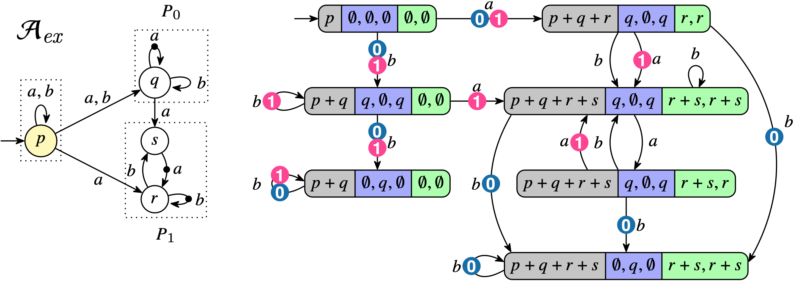
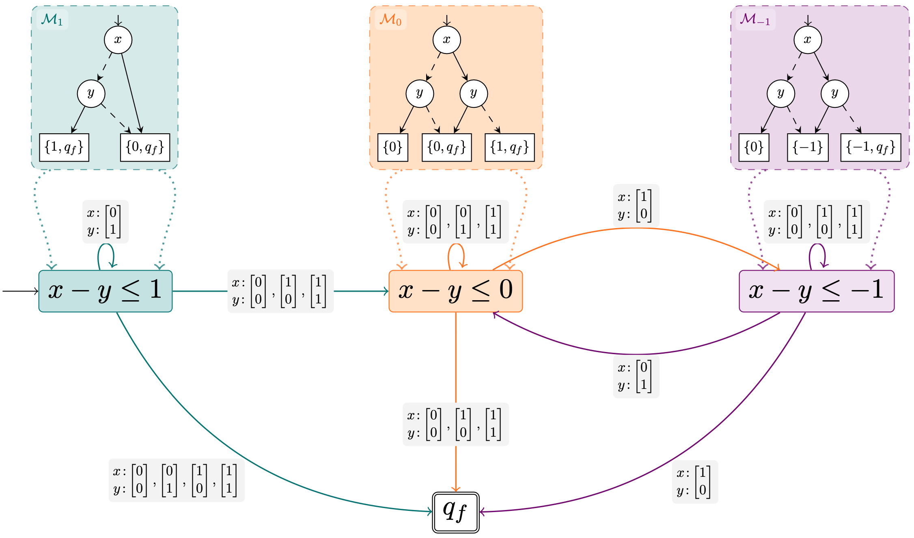

# Automata Porn
Beautiful seductive pictures of automata

## A

* Vojtěch Havlena, Ondřej Lengál, Yong Li, Barbora Šmahlíková, Andrea Turrini: Modular Mix-and-Match Complementation of Büchi Automata. TACAS'23: 249-270. Springer.

## Automaton for the Presburger formula $x-y \leq 1$ 

* Michal Hečko. Deciding Logic with Automata. Master's thesis. FIT BUT, Brno, Czech Republic. 2024.
